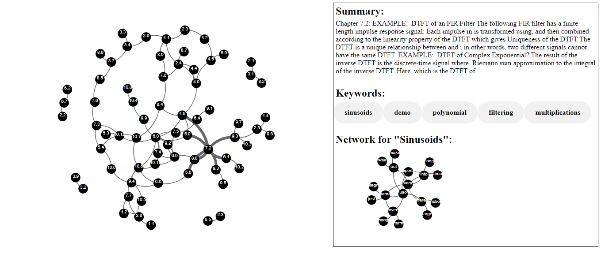

## Textbook Summarizer
Textbooks are often extremely dense and difficult to digest. This tool aims to improve student learning by creating an interactive knowledge graph of a textbook in visual form.

It extracts important keywords from each section of a textbook, and creates a graph with connections between sections containing conceptually similar keywords. This mimics the natural way we absorb information
by drawing parallels between relevant topics. By identifying the top 5 keywords of each chapter, it also condenses the information into key topics that the student can review or hone in on while studying. Drilling
down even further, a network is also generated for each keyword to show the most similar keywords (aka topics/concepts) to give insight into overarching themes.

